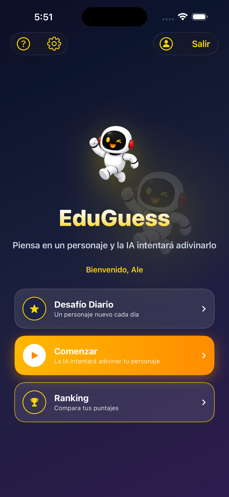
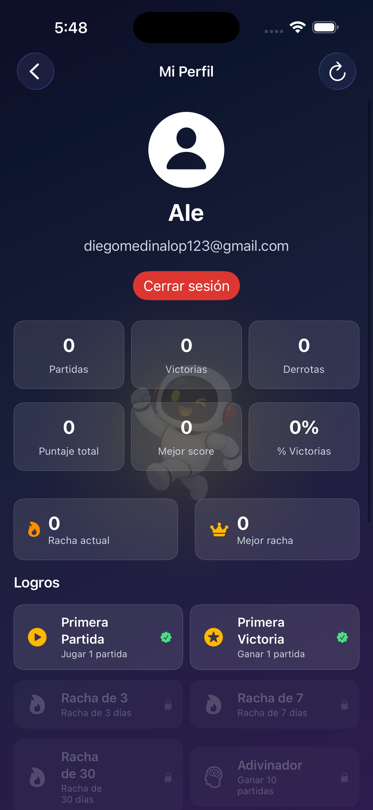
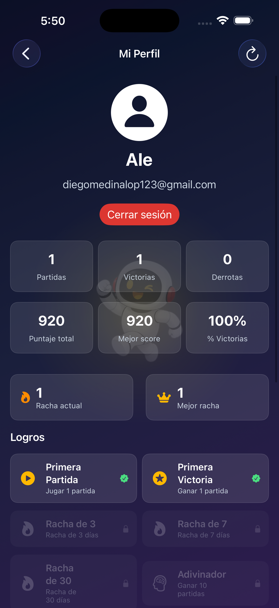
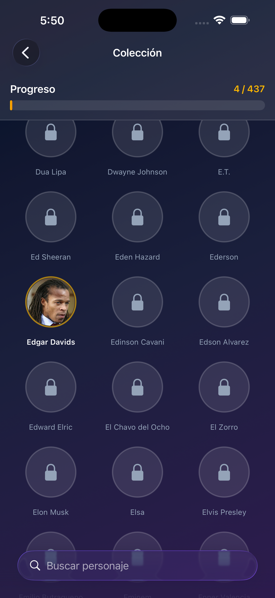
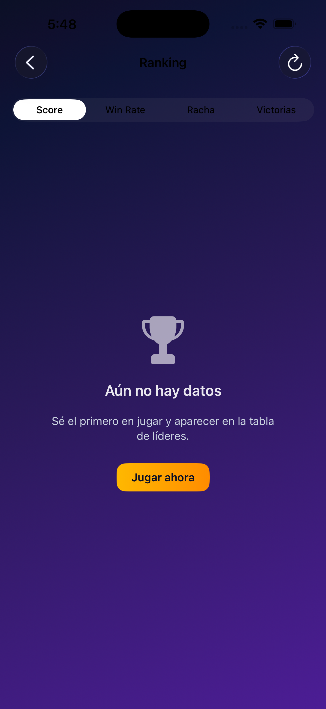
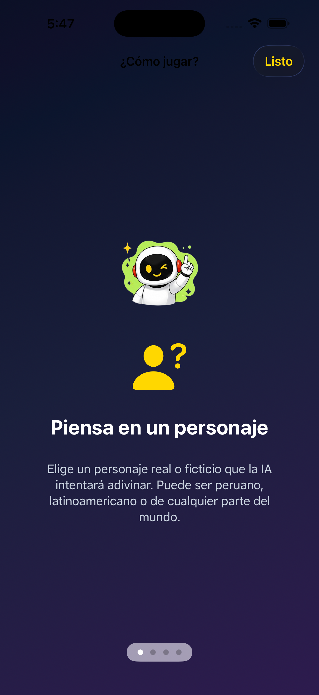
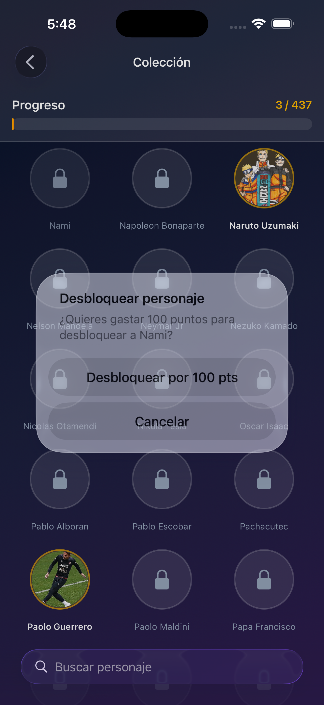

# EduGuess - La IA que Adivina Personajes

## Descripción

EduGuess es una aplicación educativa interactiva desarrollada en SwiftUI para iOS 17+ que implementa un juego estilo "Akinator". El usuario piensa en un personaje y la IA realiza preguntas de sí/no para intentar adivinarlo usando un algoritmo avanzado de entropía con scoring difuso de 5 niveles.

## Características Principales

### 🎮 Juego y IA
- **Sistema de respuestas difuso de 5 niveles**: Sí, Probablemente Sí, No sé, Probablemente No, No
- **Motor de IA avanzado**: algoritmo de entropía con information gain, theme enforcement, y learning adaptativo
- **437 personajes** en la base de datos (científicos, deportistas, artistas, personajes históricos, ficticios)
- **112 atributos booleanos** organizados en categorías temáticas
- **Aprendizaje continuo**: la IA mejora su selección de preguntas basada en efectividad histórica
- **Sistema de puntuación**: (38 − preguntas) × 10 por acierto (mínimo 10 pts)
- **Adivinanzas forzadas**: milestones en preguntas 20, 30, 40, 50, 60 para evitar juegos infinitos
- **Generación dinámica de preguntas**: integración con Google Gemini API via Firebase Remote Config

### 🎨 Interfaz y UX
- **Tema oscuro espacial**: diseño cohesivo con gradientes azul/púrpura y acentos dorados
- **Mascota robot**: 7 emociones contextuales (welcome, thinking, celebration, angry, surprised, idea, like)
- **Animaciones fluidas**: transiciones spring, haptics, confetti en victorias
- **Onboarding interactivo**: tutorial de 4 pasos para nuevos usuarios
- **Estados vacíos**: mensajes amigables cuando no hay datos
- **Offline handling**: banner de desconexión con reintentos
- **Pull-to-refresh** en ranking, perfil e historial

### 🏆 Gamificación
- **Leaderboard mejorado**: tabs de Score, Win Rate, Racha, Victorias
- **Stats sheet**: modal con estadísticas completas al tocar un usuario
- **Logros y rachas**: sistema de achievements con tracking de streaks
- **Desafío diario**: personaje único por día con ranking separado
- **Colección de personajes**: desbloqueo automático al adivinar, con imágenes de Wikipedia

### 👤 Usuario y Social
- **Autenticación**: Email/Password, Google Sign-In, Facebook Login, Sign in with Apple
- **Perfil completo**: estadísticas, historial, logros, colección
- **Eliminación de cuenta**: flujo completo con re-autenticación
- **Comentarios**: sistema de comentarios en perfiles públicos
- **Firestore**: sincronización en la nube de sesiones, stats y logros

### 🛠️ Técnico
- **Arquitectura MVVM** + SwiftData local + Firestore online
- **REST API**: Wikipedia summary para información adicional de personajes
- **Firebase Remote Config**: API keys seguras sin hardcoding
- **App Tracking Transparency**: cumplimiento de políticas de privacidad

## Stack Tecnológico

- **Lenguaje:** Swift 5.9+
- **UI:** SwiftUI (iOS 17+)
- **Persistencia local:** SwiftData
- **Backend en la nube:** Firebase (Auth, Firestore, Remote Config)
- **Autenticación social:** Google Sign-In, Facebook Login, Sign in with Apple
- **IA:** Google Gemini 2.0 Flash (generación dinámica de preguntas)
- **APIs externas:** Wikipedia REST API

## Requerimientos

- iOS 17.0 o superior
- Xcode 15.0 o superior
- macOS 14.0+ (para compilar)
- Swift 5.9+

## Estructura del Proyecto

```
EduGuess/
├── EduGuess/
│   ├── EduGuessApp.swift              # @main, SwiftData container, auth guard
│   ├── AppDelegate.swift              # Firebase, Facebook SDK, GIDSignIn setup
│   ├── Info.plist                     # URL schemes (Google, Facebook), FacebookAppID
│   ├── GoogleService-Info.plist       # Firebase config (NO Facebook keys)
│   ├── characters_seed.json           # 437 personajes de semilla
│   ├── PetEmotions.xcassets           # 7 emociones de la mascota robot
│   ├── Models/
│   │   ├── AttributeDefinition.swift  # Pool de 112 atributos booleanos
│   │   ├── Character.swift            # SDCharacter (SwiftData)
│   │   ├── GameState.swift            # enum: playing, guessed, failed
│   │   ├── Question.swift             # SDQuestion (SwiftData)
│   │   ├── UserStats.swift            # Firestore codable models + scoring
│   │   └── SDGeneratedQuestion.swift  # Modelo para preguntas generadas por IA
│   ├── ViewModels/
│   │   ├── AuthViewModel.swift        # Estado de autenticación observable
│   │   └── GameViewModel.swift        # Lógica central del juego con scoring difuso
│   ├── Views/
│   │   ├── SplashView.swift           # Pantalla inicial animada con mascota
│   │   ├── HomeView.swift             # Pantalla principal con menú animado
│   │   ├── LoginView.swift            # Login/registro + Google + Facebook + Apple
│   │   ├── QuestionView.swift         # Juego con transiciones animadas
│   │   ├── CorrectGuessView.swift     # Pantalla de victoria con confetti
│   │   ├── WrongGuessView.swift       # Pantalla de derrota + aprender
│   │   ├── CharacterCollectionView.swift # Colección de personajes desbloqueados
│   │   ├── CharacterListView.swift    # Catálogo con búsqueda
│   │   ├── CharacterDetailView.swift  # Detalle con atributos + Wikipedia
│   │   ├── CharacterFormView.swift    # Formulario de 112 atributos
│   │   ├── GameHistoryView.swift      # Historial con filtro y empty state
│   │   ├── GameSessionDetailView.swift# Detalle de sesión QA
│   │   ├── AdminListView.swift        # CRUD con confirmación al eliminar
│   │   ├── ProfileView.swift          # Estadísticas con pull-to-refresh
│   │   ├── PublicProfileView.swift    # Perfil público de otros usuarios
│   │   ├── LeaderboardView.swift      # Ranking con tabs y stats sheet
│   │   ├── DailyChallengeView.swift   # Desafío diario con ranking
│   │   ├── AchievementListView.swift  # Logros y rachas
│   │   ├── StatisticsView.swift       # Gráficas de rendimiento
│   │   ├── CommentsView.swift         # Comentarios en perfiles
│   │   ├── OnboardingView.swift       # Tutorial swipeable de 4 pasos
│   │   ├── HowToPlayView.swift        # Tutorial de juego
│   │   └── SettingsView.swift         # Ajustes, nombre, borrar datos, eliminar cuenta
│   ├── Components/
│   │   ├── AnswerButton.swift         # Botón de respuesta con 5 niveles
│   │   ├── ProgressBar.swift          # Barra de progreso
│   │   ├── QuestionCard.swift         # Tarjeta de pregunta
│   │   ├── RobotAvatar.swift          # Avatar de IA con animaciones
│   │   ├── PetAvatarView.swift        # Mascota robot con emociones
│   │   ├── PetFloatingBackground.swift # Fondo animado con mascota
│   │   ├── AvatarView.swift           # Avatar de usuario
│   │   ├── EmptyStateView.swift       # Estado vacío reutilizable
│   │   ├── OfflineBanner.swift        # Banner de desconexión
│   │   └── ToastView.swift            # Toast animado con auto-dismiss
│   ├── Services/
│   │   ├── AIService.swift            # Algoritmo de entropía con learning
│   │   ├── AttributeLearningService.swift # Aprendizaje de efectividad de atributos
│   │   ├── DataService.swift          # SwiftData CRUD + Firestore sync
│   │   ├── FirebaseAuthService.swift  # Auth: email, Google, Facebook, Apple
│   │   ├── FirestoreService.swift     # CRUD Firestore (users, sessions, leaderboard)
│   │   ├── RemoteConfigService.swift  # Firebase Remote Config para API keys
│   │   ├── GenerativeAIService.swift  # Integración con Gemini API
│   │   ├── NetworkMonitor.swift       # NWPathMonitor + conectividad
│   │   ├── SeedManager.swift          # Importa characters_seed.json
│   │   ├── WikiService.swift          # Wikipedia REST API (actor + cache)
│   │   ├── AchievementService.swift   # Lógica de logros y rachas
│   │   ├── DailyChallengeService.swift # Desafío diario
│   │   ├── NotificationService.swift  # Notificaciones locales
│   │   ├── CharacterImportService.swift # Importación de personajes
│   │   ├── AppTheme.swift             # Paleta de colores del tema oscuro
│   │   ├── ThemeManager.swift         # Gestión de temas
│   │   └── TrackingTransparencyManager.swift # ATT handling
│   └── Config/
│       └── GenerativeAIConfig.swift   # Configuración de Gemini API
├── scripts/
│   └── scrape_and_classify.py         # Scraper + LLM para generar personajes
├── GUIA_FIREBASE.md                   # Guía completa de configuración Firebase
├── TROUBLESHOOTING.md                 # Historial de errores y soluciones
├── APP_STORE_PLAN.md                  # Plan de lanzamiento a App Store
└── EduGuess.xcodeproj/
```

## Dependencias (Swift Package Manager)

- **FirebaseAuth** v12.15.0 — autenticación Email/Password, Google, Facebook, Apple (Sign in with Apple usa `AuthenticationServices` nativo de iOS)
- **FirebaseFirestore** v12.15.0 — base de datos en la nube
- **FirebaseRemoteConfig** v12.15.0 — configuración remota para API keys
- **GoogleSignIn-iOS** v7.1.0 — Google Sign-In nativo
- **facebook-ios-sdk** v17.4.0 — Facebook Login nativo (producto: `FacebookLogin`)

## Configuración Inicial

1. Clonar el repositorio
2. Abrir `EduGuess.xcodeproj` en Xcode
3. **File → Add Package Dependencies...** si los paquetes no se resuelven automáticamente
4. Ir a [Firebase Console](https://console.firebase.google.com) y crear proyecto
5. Registrar app iOS con Bundle ID `com.tecsup.EduGuess`
6. Descargar `GoogleService-Info.plist` y agregarlo al proyecto
7. Habilitar Authentication: Email/Password, Google, Facebook, Apple
8. Crear Firestore Database en modo prueba
9. Configurar Firebase Remote Config con parámetro `gemini_api_key` para la API key de Gemini
10. Registrar una app de Facebook en [developers.facebook.com](https://developers.facebook.com) y obtener App ID y Client Token
11. En el `Info.plist` del proyecto, verificar que `FacebookAppID`, `FacebookClientToken` y `FacebookDisplayName` estén configurados
12. **Product → Clean Build Folder** y **Run**

## Flujo de Autenticación

- La app usa `@UIApplicationDelegateAdaptor(AppDelegate.self)` para inicializar Firebase, Facebook SDK, GIDSignIn y Sign in with Apple
- `AuthViewModel` observa el estado de autenticación; la pantalla de login se oculta hasta que el estado se resuelve (`isReady` guard)
- Soporta cuatro métodos: Email/Password, Google Sign-In (GIDSignIn), Facebook Login (LoginManager + FacebookAuthProvider) y Sign in with Apple (ASAuthorizationAppleIDProvider con nonce SHA-256)
- Sign in with Apple usa `ASAuthorizationAppleIDProvider` con generación de nonce y hash SHA-256, verificando credenciales a través de `Auth.auth().signIn(with: AppleAuthProvider)` con Firebase
- El entitlement `com.apple.developer.applesignin` está configurado en el proyecto
- Las sesiones se cachean en UserDefaults para persistencia entre lanzamientos

## Capturas de Pantalla

| Home | Juego | Personaje Encontrado |
|---|---|---|
|  |  |  |

| Perfil | Perfil Público | Colección de Personajes |
|---|---|---|
|  |  |  |

| Leaderboard | Tutorial | Desbloquear por Puntos |
|---|---|---|
|  |  |  |

### Video Demo

[](https://youtu.be/hi_CgSXXgfo)

## Seed de Personajes

`SeedManager.swift` verifica si la base de datos SwiftData está vacía al primer inicio. Si lo está, importa automáticamente los 31 personajes desde `characters_seed.json`. Los personajes incluyen figuras peruanas y latinoamericanas (reales y ficticias) con 38 atributos booleanos cada uno.

## Scoring

- Victoria: `max(10, (38 − preguntasRealizadas) × 10)`
- Derrota: 0 puntos
- Sin límite máximo de preguntas — la IA usa un algoritmo de entropía para seleccionar la mejor pregunta en cada turno
- Las sesiones se guardan localmente en SwiftData y se sincronizan con Firestore

## Arquitectura de Datos

```
                    ┌──────────────────────────┐
                    │      EduGuess App        │
                    │  (SwiftUI + SwiftData)    │
                    └──────────┬───────────────┘
                               │
              ┌────────────────┼─────────────────┐
              │                │                  │
              ▼                ▼                  ▼
    ┌────────────────┐ ┌──────────────┐ ┌──────────────────┐
    │  Firebase Auth  │ │  Firestore   │ │    SwiftData      │
    │(email/Google/FB │ │(online sync) │ │  (local cache)    │
    │    /Apple)      │ │              │ │                   │
    └────────────────┘ └──────────────┘ └──────────────────┘
                               │
                               ▼
                     ┌──────────────────────┐
                     │     Firestore DB      │
                     │  - users/{uid}        │
                     │  - game_sessions/{id} │
                     │  - leaderboard (vista)│
                     │  - daily_challenges   │
                     │  - achievements       │
                     └──────────────────────┘
```

## Métricas del Proyecto

- **61 archivos Swift**
- **~10,000 líneas de código**
- **437 personajes** en la base de datos
- **112 atributos** organizados temáticamente
- **5 niveles de respuesta** difusa
- **7 emociones** de la mascota robot
- **20 vistas** principales
- **17 servicios** de backend y lógica

## Contacto

**Descripción:** EduGuess es una aplicación educativa interactiva en SwiftUI para iOS 17+ que implementa un juego estilo "Akinator". El usuario piensa en un personaje y la IA realiza preguntas de sí/no para intentar adivinarlo usando un algoritmo avanzado de entropía con scoring difuso de 5 niveles. Incluye autenticación social, persistencia en la nube con Firestore y generación dinámica de preguntas mediante Google Gemini.

**Apellido, Nombre:** Salazar Quina, Daniela Nicol
**Apellido, Nombre:** Medina Lopez, Diego Alejandro

**Equipo:** EduGuess

Repositorio: github.com/Dieegooml/movilesEduGuess
